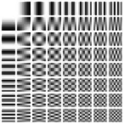

# Análise e Implementação de Algoritmos de Compressão de Imagem <h1>
## Analysis and Implementation of Image Compression Algorithms <h1>
  
###  Apresentação 

O presente projeto foi originado no contexto das atividades da disciplina de pós-graduação *EA979A - Introdução a Computação Gráfica e Processamento de Imagens*, oferecida no primeiro semestre de 2022, na Unicamp, sob supervisão da Profa. Dra. Paula Dornhofer Paro Costa, do Departamento de Engenharia de Computação e Automação (DCA) da Faculdade de Engenharia Elétrica e de Computação (FEEC).

> |Nome  | RA | Curso|
> |--|--|--|
> | Rafaella Pafaro  | 205087  | Eng. de Computação|
> | Nathan Batista   | 222852  | Eng. de Computação|

### Descrição do Projeto 
> O Objetivo do projeto será estudar e implementar um algoritmo de compressão de imagem baseado no método JPEG. 
A compressão JPEG é baseada no algoritmo DCT (Discrete Cosine Transform), que por sua vez é uma “simplificação” do DFT (Discrete Fourier Transform) e comumente apresenta uma certa perda de qualidade ao recuperar a imagem comprimida.
> Neste projeto, implementamos duas variações do JPEG:

  > Lossy: Método de compressão mais usado, apresenta uma redução na qualidade da imagem porém o tamanho do arquivo é significativamente reduzido.
  
  > Lossless: Método de compressão em que a imagem é reconstruída sem perdas (ou com perdas muito pequenas).

  
### JPEG

 > JPEG (ou JPG) é um acrónimo para Joint Photographic Experts Group, grupo esse que criou a marca em 1992. É um método de compressão que possibilita um "trade off"  ajustável entre qualidade de imagem e espaço de armazenamento. 
 
 > Essa “perda” de qualidade é calculada, e ocorre nas componentes em que a visão humana peca (luminância e crominância), por isso que caso a imagem seja RGB ela primeiramente é convertida para YCbCr ou YUV.
  
 > Pode ser usada tanto para compressão com perda quanto sem perda. Para compressão com perda utilizaremos o DCT e uma matriz de quantização para remover as altas frequências do sinal (pouco perceptíveis aos olhos humanos), depois usaremos a entropia para recuperar a imagem. Já no método sem perda utilizaremos também uma modularização delta para explorar correlações entre blocos vizinhos da imagem.
  
>  O algoritmo é baseado na técnica Discrete Cosine Transform, proposta por Nasir Ahmed em 1972. Até os dias de hoje, JPEG é o método de compressão mais utilizado para imagens digitais.
  
### DCT
  
> DCT é baseado em DFT (Discrete Fourier Transform) com a única diferença que a parte imaginária é excluída já que estamos trabalhando com sinais reais.
  
 Fórmula DCT 1D (Equação 1):
  $$F(i) = {1  \over \sqrt{2N}} C(i) \sum_{x=0}^{N-1} f(x)cos({(2x + 1)i \pi \over 2 N}) $$
 
 - Se u = 0, $\ C(u) = {1  \over \sqrt{2N}}  $
 - Se u > 0, $\ C(u) = 1  $
  
 Fórmula DCT 2D (Equação 2):
  $$F(i,j) = {1  \over \sqrt{2N}} C(i)C(j) \sum_{x=0}^{N-1} \sum_{y=0}^{N-1} f(x,y)cos({(2x + 1)i \pi \over 2 N})cos({(2y + 1)j \pi \over 2 N}) $$
 
 - Se u = 0, $\ C(u) = {1  \over \sqrt{2N}}  $
 - Se u > 0, $\ C(u) = 1  $
  
  Fórmula DCT 2D inversa (Equação 3):
   $$f(x,y) = {1  \over 2}  \sum_{x=0}^{N-1} \sum_{y=0}^{N-1} C(i)C(j) F(i,j) cos({(2x + 1)i \pi \over 2 N})cos({(2y + 1)j \pi \over 2 N}) $$
  
  Pode ser simplificada como (Equação 4):
   $$f(x,y) = \sum_{x=0}^{N-1} \sum_{y=0}^{N-1} F(i,j) P(i,j) $$
  
> $P(i,j)$ são funções-base, ou primitivas, da DCT:
  
 
  
 > $F(i,j)$ corresponde às quantidades de cada função primitiva que devem ser combinadas para obter o bloco original da imagem.
 
  > A DCT é uma função separável, independente na horizontal e na vertical e por isso pode ser feita sequencialmente através do produto matricial (Equação 5) :
  
  $$DCT = C \ x \ B \ x \ C^T $$    
  
  > Onde $B$ é um bloco de 8x8 pixels da imagem original e $C$ é uma matriz de transformação igual a:
  - Se i = 0, $\ C_{i,j} = {1  \over 2\sqrt{2N}}  $
  - Se 0 $\ \leq \$ i $\ \leq \$ 7, $\ C_{i,j} = {1  \over 2}cos({(2j+1)i\pi) \over 16})  $
  
  > $C_{i,j} = $
  
  
			      [ .354 	.354    .354    .354    .354     .354     .354     .354	]
			      [	.490 	.416    .278    .098   -.098    -.278   -.416    -.490	]
			      [	.462 	.191   -.191   -.462    -.462    -.191    .191    .462	]
                          [ .416   -.098   -.490   -.278     .278      .490    .098   -.416	]
		              [ .354   -.354   -.354    .354     .354     -.354   -.354    .354	]
			      [	.278   -.490    .098    .416    -.416     -.098    .490   -.278	]
			      [	.191   -.462    .462   -.191    -.191      .462   -.462    .191	]
			      [	.098   -.278    .416   -.490     .490     -.416    .278   -.098	]
  
  
  
  
  
  
  
### Referências Bibliográficas
> http://www.dpi.inpe.br/~carlos/Academicos/Cursos/Pdi/SemPerdas.htm
> http://computacaografica.ic.uff.br/transparenciasvol2cap8.pdf
> https://www.spiedigitallibrary.org/conference-proceedings-of-spie/2419/0000/DCT-based-scheme-for-lossless-image-compression/10.1117/12.206386.full?SSO=1
  
  
  
